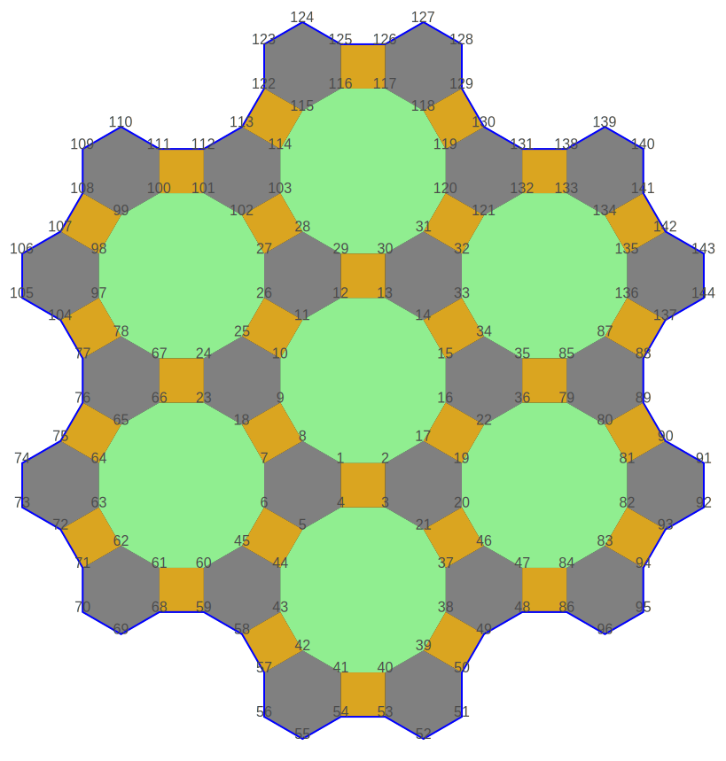

# Tessella

## Tilings by regular polygons

**Tessella** is a Scala 3 library compatible with Scala.js
that helps to deal with finite unit-regular-polygon tessellations of a flat surface,
a classical theme in the wider field of @link:[tessellations](https://en.wikipedia.org/wiki/Tessellation) { open=new } (or _tilings_).

@@@ note

See a [mathematical definition of tiling](tiling-definition.html)
for a more accurate notion of the chosen constraints.

@@@

```raw
<div style="width: 400px;">
```
|  |
|---------------------------------------------|
| _Finite set of a **[(4.6.12)]** pattern_    |
```raw
</div>
```

## Setup

Add the following dependency to your `build.sbt` file:

@@@vars
~~~ scala
libraryDependencies += "io.github.scala-tessella" %% "tessella" % "$project.version$" // Use %%% instead of %% if you're using ScalaJS
~~~
@@@

## Getting started

First, start with the following import:

```scala
import io.github.scala_tessella.tessella.Tiling.*
```

Then you can write something like:

```scala
Tiling.fromPolygon(5) // Tiling(1--2, 1--5, 2--3, 3--4, 4--5)
Tiling.fromPolygon(7).graphNodes // List(1, 2, 3, 4, 5, 6, 7)
Tiling.fromPolygon(4).area // 1.0
```

@@@ index
* [What is a Tiling](what-is.md)
* [Math definition](tiling-definition.md)
* [Tiling validation](tiling-validation.md)
* [Tiling to SVG](tiling-SVG.md)
* [Tiling to DOT](tiling-DOT.md)
* [Regular](regular.md)
* [Semi regular](semiregular.md)
* [Improvements](improvements.md)
* [Reference](reference.md)
* [GitHub repository](github.md)

@@@

## Tessellation as graph

Each tessellation is internally described as an
@link:[undirected graph](https://en.wikipedia.org/wiki/Graph_(discrete_mathematics)#Undirected_graph) { open=new }, where:

*   each **node** of the graph is a _**vertex**_ of a polygon and it is represented by a unique `Int`
*   each **edge** of the graph is a _**side**_ of a polygon

The graph describing the tessellation is a `Tiling` object.

@@@ note

An undirected graph is not always a valid `Tiling`,
see [Tiling validation](tiling-validation.html).

@@@

## Conversion

A `Tiling` can be rendered as an SVG vector image,
see [Tiling to SVG](tiling-SVG.html).

Being an undirected graph, it can also be converted to DOT language,
see [Tiling to DOT](tiling-DOT.html).

## Programmatic creation

A `Tiling`  can be created through algorithms.
Many of them, exploiting linear symmetries or growth strategies,
are already available from the `creation` subpackage.

See [Regular](regular.html) and [SemiRegular](semiregular.html).

## Deprecation

@@@ warning

This library is replacing the previous project at @link:[github.com/mcallisto/tessella](https://github.com/mcallisto/tessella) { open=new }, now deprecated.

@@@

Read here about the [improvements](improvements.html).
