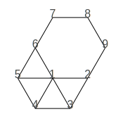

# Conversion to DOT

Each `Tiling` object has a `toDOT(...)` method that returns a `String`
in @link:[DOT](https://en.wikipedia.org/wiki/DOT_(graph_description_language)) { open=new } language,
describing the undirected graph.

```scala
import io.github.scala_tessella.tessella.conversion.DOT.*

Tiling.fromFullVertex(FullVertex.s("(3₄.6)")).toDot() // """graph{...
```
```raw
<div style="width: 300px;">
```
|      |
|----------------------------------------|
| _Finite set of a **[(3₄.6)]** pattern_ |
```raw
</div>
```

This `Tiling` is returned as:

```
graph{
2 -- 9
2 -- 3
3 -- 4
4 -- 5
5 -- 6
6 -- 7
7 -- 8
8 -- 9
1 -- 6
1 -- 5
1 -- 4
1 -- 3
1 -- 2
}
```